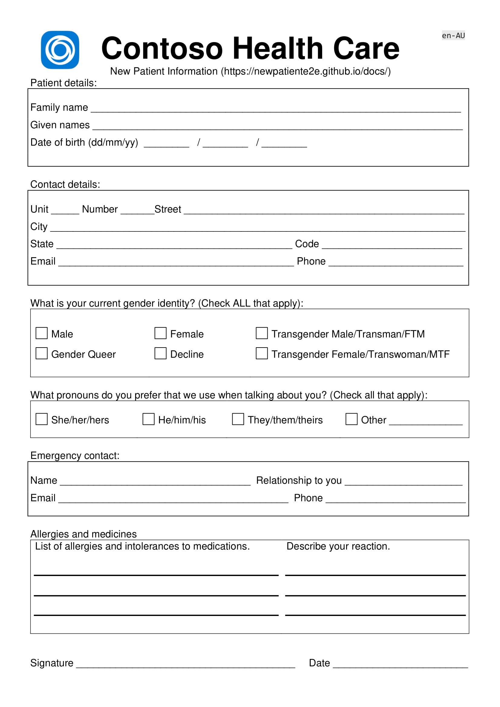

# Tutorial Intro

Applied AI and Cognitive Services End to End Health Sector focus built around Form Recognizer Scenario: Health Sector – New Patient registration.

## Problem Statement

Streamline and improve accuracy of new patient registration system. New patient registration is still a paper-based process and will continue to be for the foreseeable future.

This solution aims to address data issues that creep in with a paper-based systems as well as reduce the overhead associated with entering the new patient information into backend systems.

## Personas

|  Persona |   | |
|---|---|---|
| Surgery admin: Drew |  Drew role is to ensure new patient are registered in the system. Drew also verifies new patient data before committing to the patient data to the patient system. |  |
| Nurse: Alex | Alex uses new patient registration to understand any existing allergies or medicine reactions. |  |
| Doctor: Anthony |  Anthony uses new patient registration to understand any existing allergies or medicine reactions. Anthony uses the new patient system to record medical events. |  |

## New registration process

1. New patient completes form.
1. Uploads, then verifies information including spell check.
1. Submits verified new data.
1. Surgery admin verifies registration and adds to the doctors patient management system.
1. Data is stored in patient system.
1. Document data analyzed and translated.

## New Patient Registration form

