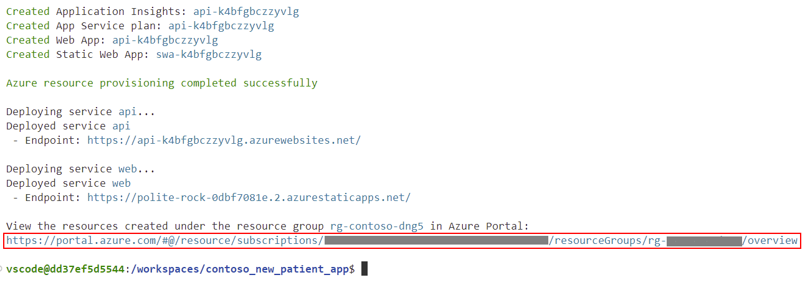

# Create Azure services

## Deploy Azure services

The following services will be created in your Azure subscription:

1. [Azure Form Recognizer](https://azure.microsoft.com/services/form-recognizer?WT.mc_id=aiml-77396-cxa).
1. [Azure Cosmos DB](https://learn.microsoft.com/azure/cosmos-db/introduction?WT.mc_id=aiml-77396-cxa).
1. [Azure Static Web Apps](https://azure.microsoft.com/services/app-service/static/?WT.mc_id=aiml-77396-cxa).

## Open a terminal window in VS Code

From VS Code, select <kbd>Ctrl+Shift+`</kbd> to open a new terminal window.

### Create the Azure Patient Registration Services

From the terminal window, run the following commands to create the Azure Patient Registration Services.

1. Authenticate to Azure by running the `az login --use-device-code` command.
1. Initialize your Azure environment with `azd init` command.
<!-- 1. Follow the prompts to log in to your Azure subscription. -->
1. Create an environment name. For this workshop, the environment name must be globally unique. Create a unique environment name by appending a random six digital number after **contoso-health-app-NNNNNN**, for example, **contoso-health-app-318721**. But don't use the example name, use your own.
1. Select a region (e.g: **eastus**).
1. Select your subscription.
1. Deploy the Azure services with `azd up --debug`.

    :::note

    It will take approximately 5 minutes to deploy the Azure services. So now is a great time to grab a cup of coffee or tea or read the next section of the workshop documentation.

    :::

    :::tip

    - You can only have one free Azure Form Recognizer service in your Azure subscription.
    <!-- - If the `azd up` command fails, then rerun the command with the debug flag `azd up --debug` to see detailed error messages. -->
    - If your azd environment fails to deploy, you can delete the environment by deleting the `.azure` folder in the `contoso_new_patient_app` folder.

    :::

1. When  the `azd up` command completes, select the **View resources** link to open the newly created resource group in the Azure portal.

    

1. Leave the Azure portal open in your web browser as you'll need to return to it later in the workshop.
1. Leave VS Code open, as you'll need it in the next section of the workshop.
