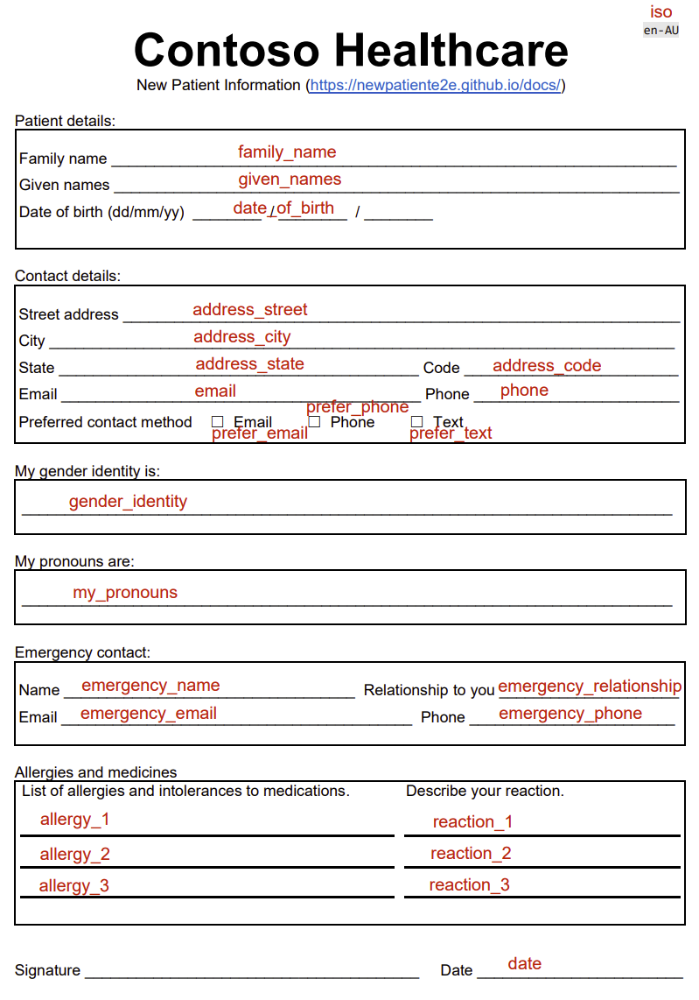

# Create custom model

Form Recognizer uses advanced machine learning to extract text and table data from your documents. You can train custom models to extract data specific to your forms, or use the prebuilt models to extract common fields from receipts, invoices, and business cards.

To train a custom model, you need to provide a set of labeled training documents. The training documents should be in the same format as the documents you want to recognize. For example, if you want to recognize receipts, you should provide labeled training receipts.

You only need five examples of the same type of document to train a custom model. For example, if you want to recognize receipts, you only need five labeled receipts.

## Custom model types

Custom models can be one of two types, [**custom template**](https://docs.microsoft.com/azure/applied-ai-services/form-recognizer/concept-custom-template) or custom form and [**custom neural**](https://docs.microsoft.com/azure/applied-ai-services/form-recognizer/concept-custom-neural) or custom document models. The labeling and training process for both models is identical, but the models differ as follows:

<!-- ### Custom template model

The custom template or custom form model relies on a consistent visual template to extract the labeled data. The accuracy of your model is affected by variances in the visual structure of your documents. Structured  forms such as questionnaires or applications are examples of consistent visual templates.

Your training set will consist of structured documents where the formatting and layout are static and constant from one document instance to the next. Custom template models support key-value pairs, selection marks, tables, signature fields, and regions. Template models and can be trained on documents in any of the [supported languages](https://docs.microsoft.com/azure/applied-ai-services/form-recognizer/language-support). For more information, *see* [custom template models](https://docs.microsoft.com/azure/applied-ai-services/form-recognizer/concept-custom-template).

### Custom neural model

The custom neural (custom document) model uses deep learning models and  base model trained on a large collection of documents. This model is then fine-tuned or adapted to your data when you train the model with a labeled dataset. Custom neural models support structured, semi-structured, and unstructured documents to extract fields. Custom neural models currently support English-language documents. When you're choosing between the two model types, start with a neural model to determine if it meets your functional needs. See [neural models](https://docs.microsoft.com/azure/applied-ai-services/form-recognizer/concept-custom-neural) to learn more about custom document models. -->

## New patient registration form

In this tutorial, you will create a custom template model to recognize the fields in the new patient registration form shown below. There are five forms in the training set, and each form contains the same fields, four of the forms have been labelled, the fifth form is unlabeled. As part of this tutorial, you will label the fifth form.

