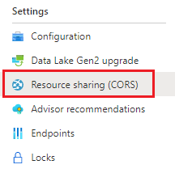
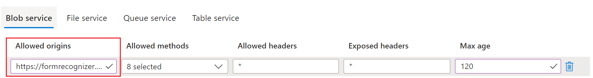

# Upload training data

This topic describes how to upload your training data to the Form Recognizer Studio.

This tutorial includes a *New Patient Registration Form* and matching label data that you need to upload to an Azure storage container.

The label data describes the location of the fields on the forms and was created for the tutorial using Form recognizer Studio. The label data is in a JSON file that is named the same as the form file. For example, the label data for the form named `form1.pdf` is in the file named `form1.pdf.json`. The label data is in the same folder as the form files.

## Create a storage container

1. In the Azure portal, select **Create a resource**.
1. In the search box, enter **Storage account** and select **Storage account** from the results.
1. On the **Create storage account** page, enter the following values:
    - **Subscription**: Select the subscription that you are using for this lab.
    - **Resource group**: Select **Create new** and enter `New Patient Registration` as the name.
    - **Storage account name**: Enter a unique name for your storage account.
    - **Location**: Select the location that is closest to you.
    - **Performance**: Select **Standard**.
    - **Account kind**: Select **StorageV2 (general purpose v2)**.
    - **Replication**: Select **Locally-redundant storage (LRS)**.
    - **Secure transfer required**: Select **Disabled**.
    - **Access tier**: Select **Hot**.

## Configure CORS

[CORS (Cross Origin Resource Sharing)](https://docs.microsoft.com/rest/api/storageservices/cross-origin-resource-sharing--cors--support-for-the-azure-storage-services) needs to be configured on your Azure storage account for it to be accessible from the Form Recognizer Studio. To configure CORS in the Azure portal, you'll need access to the CORS tab of your storage account.

1. Select the CORS tab for the storage account.

   

1. Start by creating a new CORS entry in the Blob service.

1. Set the **Allowed origins** to `https://formrecognizer.appliedai.azure.com`.

   

    > You can use the wildcard character '*' rather than a specified domain to allow all origin domains to make requests via CORS.

1. Select all the available 8 options for **Allowed methods**.

1. Approve all **Allowed headers** and **Exposed headers** by entering an * in each field.

1. Set the **Max Age** to 120 seconds or any acceptable value.

1. Select the save button at the top of the page to save the changes.

CORS should now be configured to use the storage account from Form Recognizer Studio.

## Clone the tutorial repository

Follow these steps to clone the tutorial repository to your local machine.

1. Install [Git](https://git-scm.com/downloads).
1. Open a command prompt and navigate to the folder where you want to clone the tutorial repository.
1. Run the following command to clone the tutorial repository:

    ```bash
    git clone https://github.com/newpatiente2e/new_patient_assets.git
    ```

## Upload new patient registration form training data

Upload the *New Patient Registration Form* and matching label data to the storage container that you created in the previous step.

1. In the Azure portal, select the storage account that you created in the previous step.
1. On the **Storage account** page, select **Containers**.
1. On the **Containers** page, select **+ Container**.
1. On the **Create container** page, enter `trainingdata` as the name and select **OK**.
1. On the **Containers** page, select the **trainingdata** container.
1. On the **trainingdata** page, select **Upload**.
1. On the **Upload** page, select **Add files**.
1. In the **Add files** dialog, select the all the files from the **new_patient_assets/training_labelled** folder you cloned to your computer.
1. Select **Upload**.
