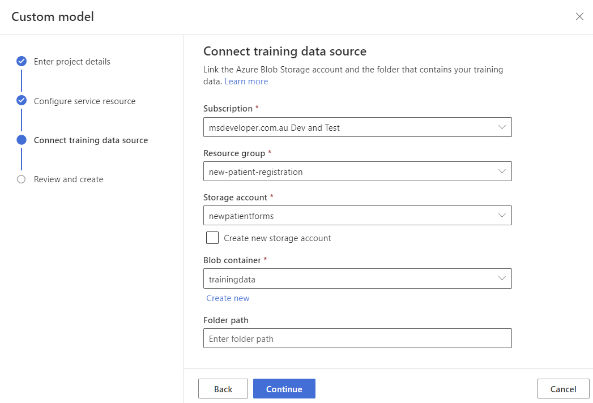

# Create a project

The Form Recognizer Studio provides and orchestrates all the API calls required to complete your dataset and train your model.

1. Start by navigating to the [Form Recognizer Studio](https://formrecognizer.appliedai.azure.com/studio). The first time you use the Studio, you'll need to [initialize your subscription, resource group, and resource](https://docs.microsoft.com/azure/applied-ai-services/form-recognizer/quickstarts/try-v3-form-recognizer-studio). Follow the [additional prerequisite for custom projects](https://docs.microsoft.com/azure/applied-ai-services/form-recognizer/quickstarts/try-v3-form-recognizer-studio#additional-prerequisites-for-custom-projects) to configure the Studio to access your training dataset.

1. In the Studio, select the **Custom models** tile, on the custom models page and select the **Create a project** button.

    

    1. On the create project dialog, provide a name for your project, optionally a description, and select continue.

        1. Select your Azure subscription.
        1. Create a new resource group named **new-patient-registration**.
        1. Name the service **form-recognizer**.
        1. Select the location closest to you.
        1. Select the pricing tier **F0**.
        1. Select API version **2022-08-31 (General Availability)**.
        1. Select **Continue**.

        

    <!-- Custom neural models models are only available in a few regions. If you plan on training a neural model, please select or create a resource in one of [these supported regions](https://docs.microsoft.com/azure/applied-ai-services/form-recognizer/concept-custom-neural#supported-regions). -->

1. Next select the storage account where you uploaded your custom model training dataset. The **Folder path** should be empty if your training documents are in the root of the container. If your documents are in a subfolder, enter the relative path from the container root in the **Folder path** field. Once your storage account is configured, select continue.

    1. Select your Azure subscription.
    1. Select the resource group **new-patient-registration**.
    1. Select the storage account you created in the previous step.
    1. Select the **trainingdata** container.
    1. Select **Continue**.
    1. Select **Create project**.

    

The form recognizer service will now be created and configured. Once the service is created, the Studio will open the project and display the **Label data** page.
