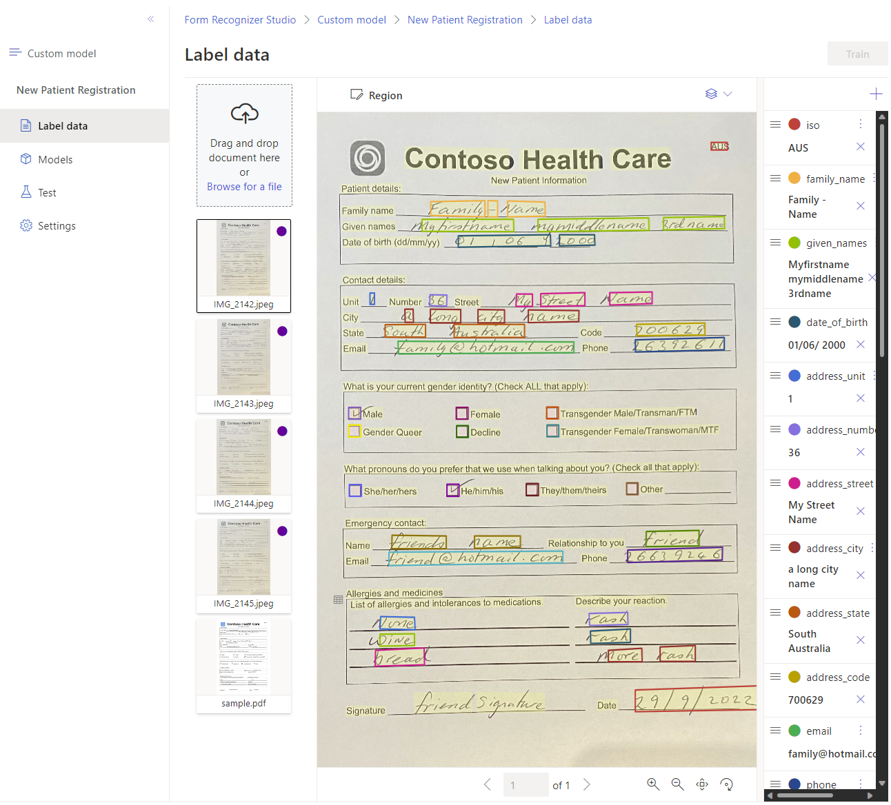

# Label your data

In your project, there will be five documents, four of the documents will have an assciated purple dot to indicate the documents have need analyzed and labels. The fifth document need to be analyzed and labelled.

The following steps will show you how to label your data.

1. Select the last document in the list of documents named sample.pdf to analyze and then open the document for labelling.
1. Select the ISO language code for the document. You'll find this field in the top right-hand corner of the document.
1. Select the Family name field and then from the list of labels select the label `family_name`.
1. Repeat this process for the other fields in the document. It's important to label all the fields in the document as they will be used to train the model.

    To assign a value to the field, choose a word or words in the document and select the field in either the dropdown or the field list on the right navigation bar. You'll see the labeled value below the field name in the list of fields.

    - given_names
    - date_of_birth
    - address_unit
    - address_number
    - address_street
    - address_city
    - address_state
    - address_code
    - email
    - phone
    - gender identity: male, female, ftm, mtf, queer, decline
    - preferred pronoun: she, he, they, other
    - emergency_name
    - emergency_relationship
    - emergency_email
    - emergency_phone
    - allergy_1
    - reacton_1
    - allergy_2
    - reaction_2
    - allergy_3
    - reaction_3

You now have all the documents in your dataset labeled. If you look at the storage account, you'll find a *.labels.json* and *.ocr.json* files that correspond to each document in your training dataset and a new fields.json file. This training dataset will be submitted to train the model.
