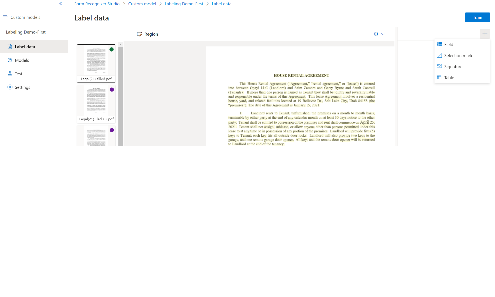

# Label your data

In your project, your first task is to label your dataset with the fields you wish to extract.

You'll see the files you uploaded to storage on the left of your screen, with the first file ready to be labeled.

1. To start labeling your dataset, create your first field by selecting the plus (➕) button on the top-right of the screen to select a field type.

    

1. Enter a name for the field.

1. To assign a value to the field, choose a word or words in the document and select the field in either the dropdown or the field list on the right navigation bar. You'll see the labeled value below the field name in the list of fields.

1. Repeat the process for all the fields you wish to label for your dataset.

1. Label the remaining documents in your dataset by selecting each document and selecting the text to be labeled.

You now have all the documents in your dataset labeled. If you look at the storage account, you'll find a *.labels.json* and *.ocr.json* files that correspond to each document in your training dataset and a new fields.json file. This training dataset will be submitted to train the model.

