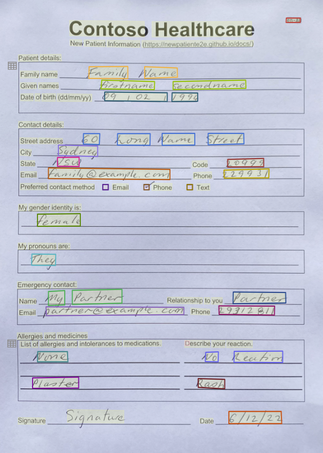

# Label your data

In your project, there are five documents, four of the documents have a purple dot to indicate the documents have been analyzed and labeled. The fifth document needs to be analyzed and labeled.

## Video introduction to labeling forms with Form Recognizer

Watch this YouTube to understand how to label a form. Open the video on Youtube to watch in full screen.

<iframe width="800" height="450" src="https://www.youtube.com/embed/d1QHX47mSDo" title="YouTube video player" frameborder="0" allow="accelerometer; autoplay; clipboard-write; encrypted-media; gyroscope; picture-in-picture" allowfullscreen></iframe>

## New patient registration form

The following image is of the fifth document that needs to be labeled.

## Label the new patient registration form

The following steps will show you how to label your data.

1. Select the last document in the list of documents. The document is named _sample.pdf_. Selecting the document will analyze and then open the document for labeling.
1. Select the ISO language code for the document. You'll find this field in the top right-hand corner of the document, then from the list of labels, select **iso**.
1. Select the Family name field, then from the list of labels, select `family_name`.

    You can filter the list of labels by typing the label name in the list of labels dropdown. For example, if you type `family` in the list of labels, the `family_name` label will be displayed.

1. Repeat this process for the other fields in the document. It's important to label all the fields in the document as they will be used to train the model.

    - given_names
    - date_of_birth
    - address_street
    - address_city
    - address_state
    - address_code
    - email
    - phone
    - prefer_email
    - prefer_phone
    - prefer_text
    - gender_identity
    - my_pronouns
    - emergency_name
    - emergency_relationship
    - emergency_email
    - emergency_phone
    - allergy_1
    - reaction_1
    - allergy_2
    - reaction_2
    - allergy_3
    - reaction_3

You now have all the documents in your dataset labeled. If you look at the storage account, you'll find a *.labels.json* and *.ocr.json* files that correspond to each document in your training dataset and a new fields.json file. This training dataset will be submitted to train the model.
