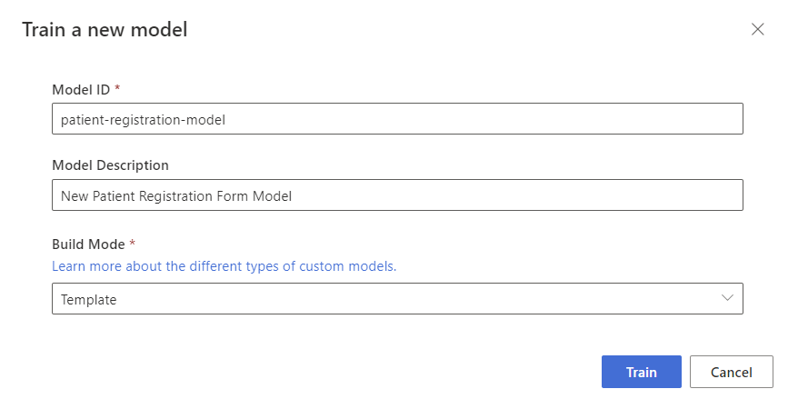

# Train your model

With your dataset labeled, you're now ready to train your model. Follow these steps to train your model.

1. Select the train button in the upper-right corner.

1. From the train a new model dialog, provide a unique model ID and, optionally, a description. The model ID accepts a string data type.
1. Select **Template** from the **Build Mode**.

    Learn more about the [model types and capabilities](https://docs.microsoft.com/azure/applied-ai-services/form-recognizer/concept-custom).

    

1. Select **Train** to initiate the training process.

1. Template models train in a few minutes. Neural models can take up to 30 minutes to train.

1. Navigate to the *Models* menu to view the status of the train operation.

## Test the model

Once the model training is complete, you can test your model by selecting the model on the models list page.

1. Select the model and select on the **Test** button.

1. Select the `+ Add` button to select a file to test the model.

1. With a file selected, choose the **Analyze** button to test the model.

1. The model results are displayed in the main window and the fields extracted are listed in the right navigation bar.

1. Validate your model by evaluating the results for each field.

1. The right navigation bar also has the sample code to invoke your model and the JSON results from the API.

Congratulations you've trained a custom model in the Form Recognizer Studio! Your model is ready for use with the REST API or the SDK to analyze documents.
