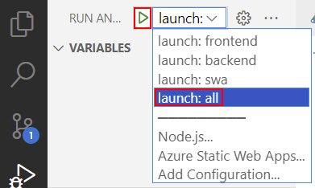

# Integrate Form Recognizer

In this section, we're going to be updating an Azure Function to call Form Recognizer to extract the patient's information from the uploaded image.

## Updating the Azure Function

1. Start VS Code and open the `contoso_new_patient_app` folder.
1. Open the `UploadFile.cs` file, located at `src/api/NewPatient/UploadFile.cs`.
1. Scroll down to the `// TODO: Call Azure Form Recognizer` section.
1. Replace the `// TODO` comment and `throw` statement with the following code

   ```csharp
   string? endpoint = Environment.GetEnvironmentVariable("FORM_RECOGNIZER_ENDPOINT");
   string? apiKey = Environment.GetEnvironmentVariable("FORM_RECOGNIZER_API_KEY");
   string? modelId = Environment.GetEnvironmentVariable("FORM_RECOGNIZER_MODEL_ID");

   if (string.IsNullOrEmpty(endpoint) || string.IsNullOrEmpty(apiKey) || string.IsNullOrEmpty(modelId))
   {
       throw new InvalidOperationException("Missing environment variables");
   }

   var credential = new AzureKeyCredential(apiKey);
   var client = new DocumentAnalysisClient(new Uri(endpoint), credential);

   var blobClient = containerClient.GetBlobClient(filename);
   var uri = blobClient.GenerateSasUri(BlobSasPermissions.Read, DateTimeOffset.UtcNow.AddMinutes(5));

   AnalyzeDocumentOperation operation = await client.AnalyzeDocumentFromUriAsync(WaitUntil.Completed, modelId, uri);
   AnalyzeResult result = operation.Value;

   var outputs = new Dictionary<string, (string, float?)>();

   foreach (AnalyzedDocument document in result.Documents)
   {
       foreach ((string fieldName, DocumentField field) in document.Fields)
       {
           outputs.Add(fieldName, (field.Content, field.Confidence));
       }
   }

   return outputs;
   ```

1. Save the file.

<details>
<summary>What is this code doing?</summary>

Let's take some time to understand what this code is doing by breaking it down piece by piece.

```csharp
string? endpoint = Environment.GetEnvironmentVariable("FORM_RECOGNIZER_ENDPOINT");
string? apiKey = Environment.GetEnvironmentVariable("FORM_RECOGNIZER_API_KEY");
string? modelId = Environment.GetEnvironmentVariable("FORM_RECOGNIZER_MODEL_ID");

if (string.IsNullOrEmpty(endpoint) || string.IsNullOrEmpty(apiKey) || string.IsNullOrEmpty(modelId))
{
    throw new InvalidOperationException("Missing environment variables");
}
```

This first piece of code is retrieving the environment variables that contain the keys and other secret information for Form Recognizer, avoiding us from hard-coding them into the code. We've also got some `null` checking, to ensure that we have set the values.

```csharp
var credential = new AzureKeyCredential(apiKey);
var client = new DocumentAnalysisClient(new Uri(endpoint), credential);
```

Here, we're creating the connection to Form Recognizer using the endpoint and API key.

```csharp
var blobClient = containerClient.GetBlobClient(filename);
var uri = blobClient.GenerateSasUri(BlobSasPermissions.Read, DateTimeOffset.UtcNow.AddMinutes(5));
```

Form Recognizer will need a URL to the image that we want to analyze, so we're creating a SAS token for the image that we uploaded to Azure Storage, which will mean that only the Form Recognizer service can access the image.

```csharp
AnalyzeDocumentOperation operation = await client.AnalyzeDocumentFromUriAsync(WaitUntil.Completed, modelId, uri);
AnalyzeResult result = operation.Value;

var outputs = new Dictionary<string, (string, float?)>();

foreach (AnalyzedDocument document in result.Documents)
{
    foreach ((string fieldName, DocumentField field) in document.Fields)
    {
        outputs.Add(fieldName, (field.Content, field.Confidence));
    }
}

return outputs;
```

Lastly, we'll call Form Recognizer, telling it which image we want to analyze and what trained model to use for that. When the result comes back, we'll loop through the fields that were found and return them as a dictionary, which will later be stored in Cosmos DB.

</details>

## Running Locally

To run the application locally, we need to set the environment variables for the Azure Function in the `local.settings.json` file.

1. Create a new file (if one doesn't already exist) at `src/api/local.settings.json` and include the following code:

    ```json
    {
        "IsEncrypted": false,
        "Values": {
          "AzureWebJobsSecretStorageType": "files",
          "FUNCTIONS_WORKER_RUNTIME": "dotnet",          
          "COSMOS_DB": "REPLACE_WITH_COSMOS_DB_CONNECTION_STRING",
          "FORM_RECOGNIZER_API_KEY": "REPLACE_WITH_FORM_RECOGNIZER_API_KEY",
          "FORM_RECOGNIZER_ENDPOINT": "REPLACE_WITH_FORM_RECOGNIZER_ENDPOINT",
          "NEW_PATIENT_STORAGE": "REPLACE_WITH_STORAGE_CONNECTION_STRING",
          "FORM_RECOGNIZER_MODEL_ID": "patient-registration-model"
        },
        "Host": {
          "CORS": "*"
        }
    }
    ```

1. Replace the placeholders with the values from the `azd env get-values` command that you saved in your text editor earlier.
1. If you followed the instructions in the previous section, you should have a `patient-registration-model` model in Form Recognizer. If you used a different name, you'll need to update the `FORM_RECOGNIZER_MODEL_ID` value in the *local.settings.json* file

Once all the environment variables have been set, you can run the application locally.

1. Open the *Run and Debug* view from the VS Code sidebar, or select <kbd>Ctrl+Shift+D</kbd> or <kbd>Cmd+Shift+D</kbd> on macOS.

    

1. From the drop down, select `launch: all`, then select the _Start Debugging_ button.

    

    :::info

    Depending on how fast your computer is, it may take up to 30 seconds for the application to start.

    :::

1. Once all the debuggers have started, navigate to [http://localhost:4280](http://localhost:4280) in your web browser.

## Deploy

Deploy the app to Azure Static Web Apps with the Azure Developer CLI.

1. From VS Code, select `` CTRL + SHIFT + ` `` to open a new terminal.
1. From the terminal, run the following command to start the function app. This command will deploy the updated function to Azure.

   ```bash
   azd deploy
   ```

## Open the patient registration app in your browser

From your browser, open the patient registration app at the URL displayed in the deployment logs.
